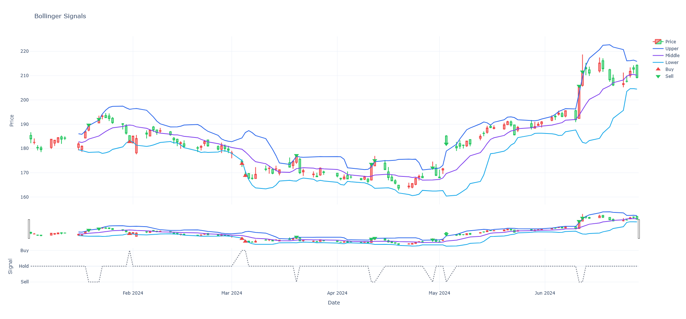
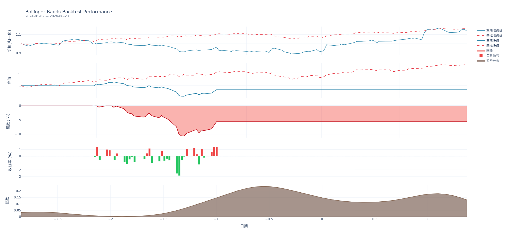
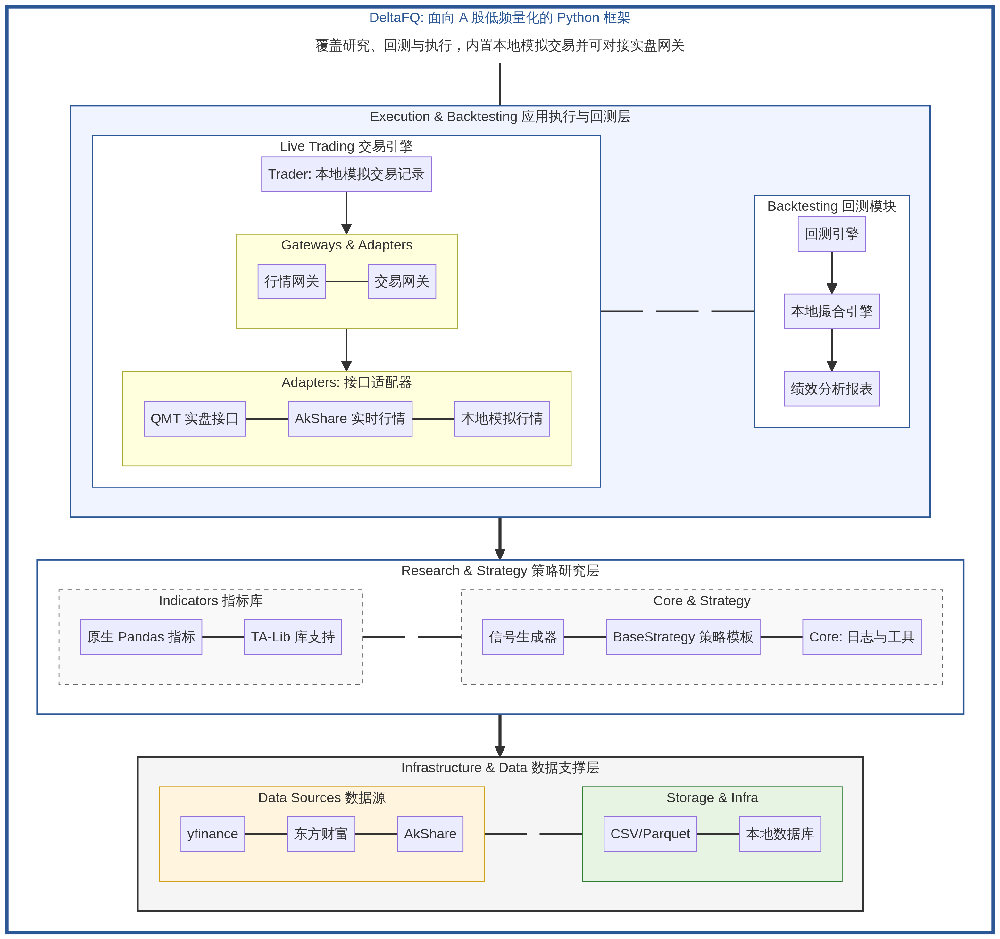

# DeltaFQ

<div align="center">

[中文](README.md) | [English](README_EN.md)


A 股低频量化一站式解决方案： 覆盖“研究-回测-执行”全生命周期，内置仿真交易环境与实盘网关接口，可构建从零到实盘的工业级 Python 量化工作流。

<p align="center">
  
  
</p>

</div>


## 学习与社区

- **体系课教程**：慕课网 AI 量化体系课（即将上线）。
- **微信公众号**：扫描下方二维码关注 **DeltaFQ开源量化**，获取最新策略研究与更新动态。

<p align="center">
  
</p>


## 安装

```bash
pip install deltafq
```

## 核心功能

- 📥 数据模块 - 集成 yfinance 免费数据接口、akshare 实时行情及 QMT 行情 API
- 🧪 指标模块 - 提供 Pandas 原生技术指标计算，内置常用 TA-Lib 指标库
- 🧠 策略模块 - 支持信号生成器与 `BaseStrategy` 模板，实现策略极速开发
- 📉 回测模块 - 高性能回测引擎，支持多策略对比、精确绩效统计与深度回撤分析
- 🤖 交易接入 - 采用可插拔网关架构，支持本地纸面交易与实盘 API 无缝切换
- 📊 可视化 - 基于 Plotly 的交互式绩效图表，支持中英文双语回测报告
- 📝 日志管理 - 统一的日志记录与输出管理，支持多级别日志与文件存储


## 快速上手

```python
import deltafq as dfq

# 1. 定义策略逻辑
class MyStrategy(dfq.strategy.BaseStrategy):
    def generate_signals(self, data):
        bands = dfq.indicators.TechnicalIndicators().boll(data["Close"])
        return dfq.strategy.SignalGenerator().boll_signals(data["Close"], bands)

# 2. 极简回测与展示
engine = dfq.backtest.BacktestEngine()
engine.set_parameters("GOOGL", "2025-07-26", "2026-01-26")
engine.load_data()
engine.add_strategy(MyStrategy(name="BOLL"))
engine.run_backtest()
engine.show_report()
engine.show_chart(use_plotly=False)
```


## 应用示例
DeltaFStation 面向 A 股低频量化，基于 deltafq 集成数据服务、策略管理与交易接入，支持模拟与实盘。项目地址：https://github.com/Delta-F/deltafstation/

<table align="center">
  <tr>
    <td></td>
    <td></td>
  </tr>
</table>


## 项目架构

```
deltafq/
├── data        # 数据获取、清洗、存储接口（支持股票、基金数据）
├── indicators  # 技术指标与因子计算
├── strategy    # 信号生成器与策略基类
├── backtest    # 回测执行、绩效度量、报告
├── live        # 事件引擎、网关抽象与路由
├── adapters    # 行情/交易适配器（可插拔）
├── trader      # 交易执行与订单/持仓管理
└── charts      # 信号、绩效图表组件
```

<table align="center">
  <tr>
    <td></td>
    <td></td>
  </tr>
</table>


## 参与贡献

欢迎通过 [Issue](https://github.com/Delta-F/deltafq/issues) 或 PR 反馈问题、提交改进。


## 许可证

MIT License，详见 [LICENSE](LICENSE)。
