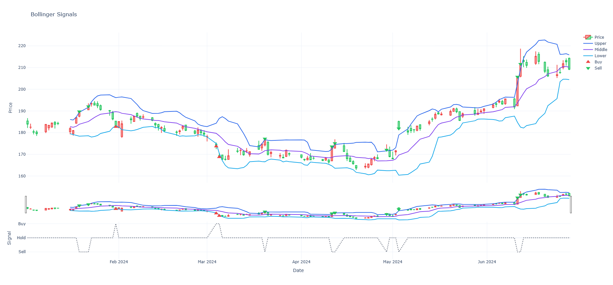
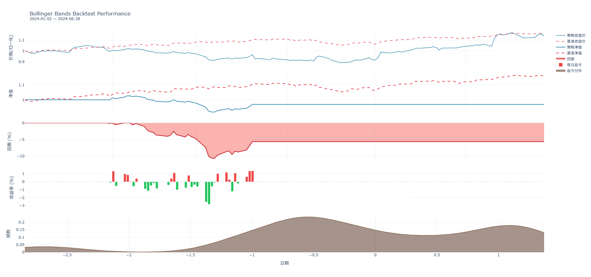
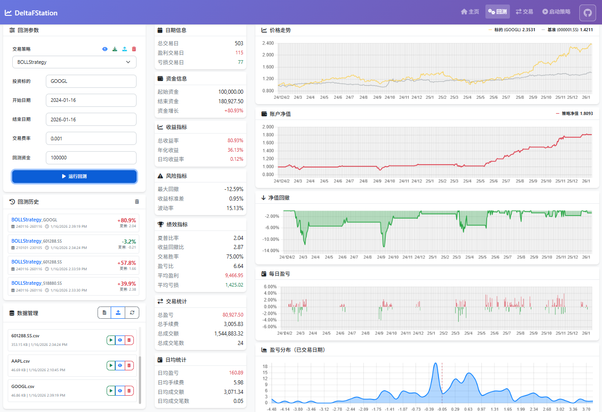
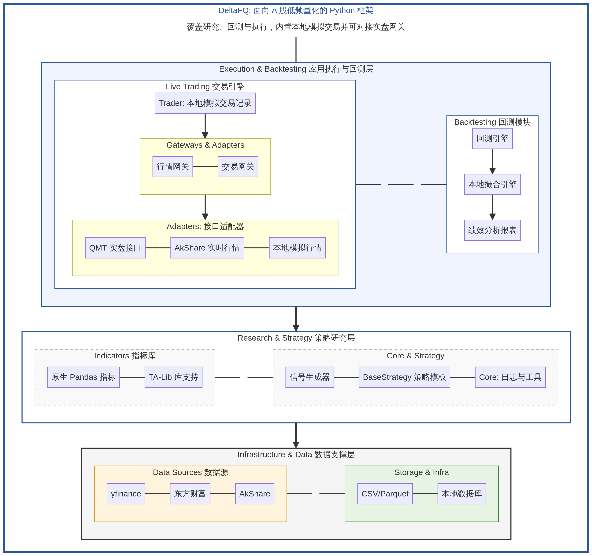
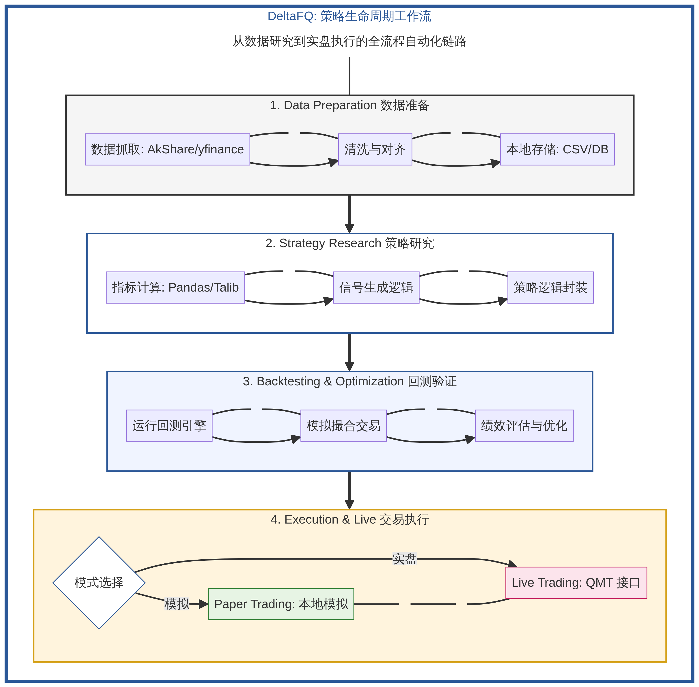

# DeltaFQ

<div align="center">

[中文](README.md) | [English](README_EN.md)


Python 开源量化框架： 覆盖“研究、回测、交易”全生命周期，构建从零到实盘的工业级量化闭环工作流。

<p align="center">
  
  
</p>

</div>


## 🎓 官方教程

#### [慕课网 - 程序员 AI 量化理财体系课](https://class.imooc.com/sale/aiqwm)

> 项目官方配套课程：深度解析本框架从 0 到 1 的架构设计，涵盖实盘闭环逻辑与工业级量化开发实战，是掌握本项目精髓的进阶必修课。


## 📦 安装

```bash
pip install deltafq
```

如需获取往期版本源码，请访问：https://pypi.org/project/deltafq/#history

## ✨ 核心功能

- 📥 多源数据 - 全球多市场历史/实时数据，开箱即用
- 🧠 极速开发 - 信号驱动架构，策略模板化快捷实现
- 📉 专业回测 - 高性能撮合引擎，深度绩效度量与分析
- ⚡ 事件驱动 - 秒级行情分发，毫秒级 Tick 信号处理
- 🤖 实盘网关 - 插件化适配，模拟与实盘接口无缝切换


## ⚡ 快速上手

```python
import deltafq as dfq

# 1. 定义策略逻辑
class MyStrategy(dfq.strategy.BaseStrategy):
    def generate_signals(self, data):
        bands = dfq.indicators.TechnicalIndicators().boll(data["Close"])
        return dfq.strategy.SignalGenerator().boll_signals(data["Close"], bands)

# 2. 极简回测与展示
engine = dfq.backtest.BacktestEngine()
engine.set_parameters("GOOGL", "2025-07-26", "2026-01-26")
engine.load_data()
engine.add_strategy(MyStrategy(name="BOLL"))
engine.run_backtest()
engine.show_report()
engine.show_chart(use_plotly=False)
```


## 🚀 应用示例
DeltaFStation 基于 deltafq 的开源量化交易云平台，集成数据服务、策略管理与交易接入，支持模拟与实盘。项目地址：https://github.com/Delta-F/deltafstation/

<table align="center">
  <tr>
    <td></td>
    <td></td>
  </tr>
</table>


## 🔌 接口集成

- yfinance ✅ - 美股、A股、港股、加密、股指
- eastmoney ✅ - 场外基金（指数、QDII、股、债、混合）
- PaperTrade ✅ - 本地模拟交易、挂单按 Tick 撮合、持仓与订单管理
- QMT API 🛠️ - 行情、实盘接口


## 🏗️ 项目架构

```
deltafq/
├── data        # 数据获取、清洗、存储接口（支持股票、基金数据）
├── indicators  # 技术指标与因子计算
├── strategy    # 信号生成器与策略基类
├── backtest    # 回测执行、绩效度量、报告
├── live        # 事件引擎、网关抽象与路由
├── adapters    # 行情/交易适配器（可插拔）
├── trader      # 交易执行与订单/持仓管理
└── charts      # 信号、绩效图表组件

documents/      # 使用说明与架构文档
├── LiveEngine.md
└── BacktestEngine.md
```

<table align="center">
  <tr>
    <td></td>
    <td></td>
  </tr>
</table>


## 🤝 参与贡献

- 反馈与改进：欢迎通过 [Issue](https://github.com/Delta-F/deltafq/issues) 或 PR 提交改进。
- 微信公众号：关注 `DeltaFQ开源量化`，获取版本更新、重要策略与量化资料。

<p align="center">
  
</p>


## 📄 许可证

MIT License，详见 [LICENSE](LICENSE)。
